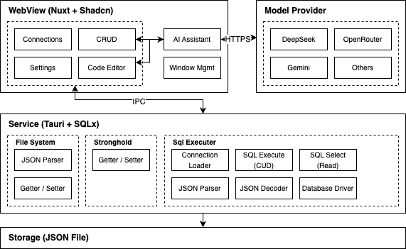

<h1 align="center">
  
  <div>Tablite</div>
</h1>

🪶 An ai driven lightweight database GUI built on `Tauri`.

## Features

- Lightweight and cross-platform build
- Natural language querying with multi-LLMs support
- Modern and easy-to-use interface
- Local data storage for secure (except for sending schema to your LLM provider)

Supported databases:

- SQLite
- MySQL

Supported LLMs:

- Gemini 2.0 Flash
- Gemini 1.5 Pro
- Gemini 1.5 Flash
- DeepSeek V3
- DeepSeek R1
- OpenRouter (Tools supported)


## Installation

You can download [Windows and Mac desktop app here](https://github.com/tmg0/tablite/releases)

For MacOS user with M1 or later, you need to execute the following command in terminal to allow the application downloaded form the internet:

```
sudo xattr -r -d com.apple.quarantine /Applications/Tablite.app
```

Or use the `x64` version in release page to bypass this issue.

## Usage

### Tables

- Fuzzy search for table names
- Dynamically filter tables with popover selectors
- Double-click a cell to enter edit mode
- Select rows for deletion
- Disvard changes or preview the actual SQL before saving
- Support re-editing SQL before saving

### Queries

- Fuzzy search for table names
- Automatically generate an SQL query from the title as a prompt
- `⌘` + `s` or click the `Save` button for saving
- Run the query and display the time costs

### Settings

- Select ai assistant based model
- Enter api keys for different providers

## Developing

```
pnpm install && pnpm tauri dev
```

### Comparisons

- Tauri: Small bundle size and low memory usage, dependence by user os, may have rendering differences across different systems/platforms due to WebKit version.

- Electron: Large bundle size and large mem usage, has high consistency in cross-platform application rendering.

|  | **Tauri** | **Electron** | **Gpui** | **Swift** |
|--|--|--|--|--|
| **Performance** | mid | low | high | high |
| **Cross Platform** | yes | yes | yes | no |
| **Community** | high | high | low | mid |
| **Size** | small | large | mid | mid |
| **Development** | mid | low | high | mid |
| **App** | ChatWise | DingTalk | Zed | Pages |

### Code Design



#### [`app`](./app)

WebView client application with official nuxt design (future.compatibilityVersion: 4), read [Directory Structure](https://nuxt.com/docs/guide/directory-structure/app).

#### [`app.components.VisTable`](./app/components/VisTable.vue)

High performance canvas based table component, powered by [VisActor](https://visactor.io/)

Support cell update and undo actions, and used update ref struct like:

```ts
/**
 * Tracks changes made to table cell contents, where:
 * - The outer key is a stringified row identifier (e.g., JSON string of row ID)
 * - The inner key is the column/property name that was modified
 * - The value is an array containing the new content(s)
 *
 * @example
 * // Changes for row with ID "93uisjxquq", updating the "content" column from "hi" to "hi tablite"
 * { "{\"id\":\"93uisjxquq\"}": { "content": ["hi", "hi tablite"] } }
 */
const changes = ref({})
```

Usage:

```vue
<VisTable
  v-model:changes="changes"
  v-model:inserts="inserts"
  v-model:selected-row-keys="selectedRowKeys"
  editable
  :columns="columns"
  :records="data"
  :deletes="deletes"
  :primary-keys="primaryKeys"
/>
```

#### [`app.composables`](./app/composables)

Reacitve vue hooks

#### [`app.composables.useText2Sql`](./app/composables/useText2Sql.ts)

Text to SQL AI Agent

#### [`app.composables.useAi`](./app/composables/useAi.ts)

Reactive [Vercel AI SDK](https://sdk.vercel.ai/) in vue port

#### [`app.utils.agent`](./app/utils/agent.ts)

Global agent creator, example [here](./app/composables/useText2Sql.ts)

`createAgent` usage:

```ts
const prompt = ref('')
const { model } = useAiProvider()

const { messages } = await createAgent(model.value!)
  .next(({ messages }: { messages: any[] }) => messages[0]!.content)
  .execute([{ role: 'user', content: prompt.value }])
```

#### [`src-tauri`](./src-tauri)

Tauri service root directory

#### [`src-tauri/src/lib.rs`](./src-tauri/src/lib.rs)

App instance entry, plugin register center (includes: sql-extra / log / store)

#### [`src-tauri/crates/tauri-plugin-sql-extra`](./src-tauri/crates/tauri-plugin-sql-extra)

Custom tauri plugin sql implement.

Heavily inspired by [tauri-plugin-sql](https://github.com/tauri-apps/tauri-plugin-sql) and extends its capabilities by adding support for multiple database types.

`sql-extra` powered by `sqlx` and provide plugin commands below:

- `plugin:sql-extra|load`: ({ db: string }) => Promise<string>
- `plugin:sql-extra|execute`: ({ db: string, query: string }) => Promise<void>
- `plugin:sql-extra|select`: <T extends any[]>({ db: string, query: string }) => Promise<T>
- `plugin:sql-extra|close`: ({ db: string }) => Promise<void>

For different type of database, `sql-extra` use `serde_json` for json decoder

- [`mysql`](../src-tauri/crates/tauri-plugin-sql-extra/src/decode/mysql.rs)
  - `"CHAR" | "VARCHAR" | "TINYTEXT" | "TEXT" | "MEDIUMTEXT" | "LONGTEXT" | "ENUM" | "DATE" | "TIME" | "DATETIME" | "TIMESTAMP"`: `string`
  - `"Float" | "DOUBLE" | "TINYINT" | "SMALLINT" | "INT" | "MEDIUMINT" | "BIGINT" | "TINYINT UNSIGNED" | "SMALLINT UNSIGNED" | "INT UNSIGNED" | "MEDIUMINT UNSIGNED" | "BIGINT UNSIGNED" | "YEAR" | "TINIYBLOB" | "MEDIUMBLOB" | "BLOB" | "LONGBLOB"`: `number`
  - `"BOOLEAN"`: `boolean`

- [`sqlite`](../src-tauri/crates/tauri-plugin-sql-extra/src/decode/sqlite.rs)
  - `"TEXT" | "DATE" | "TIME" | "DATETIME"`: `string`
  - `"REAL" | "INTEGER" | "NUMERIC" | "BLOB"`: `number`
  - `"BOOLEAN"`: `boolean`

### Agents

#### [`Text to SQL`](./app/composables/useText2Sql.ts)

Generate executable sql query with natural language.

- Analysis relevant table names by model function calling
- Provide table schema with row index
- Generate prompt by preset templates
- Generate SQL query
- Format results and response with sse

## Roadmap

Ranking here very subjective and based on personal pain points.

### SQL Client

- Support create table by GUI
- Support create connection by a form instead of a connection string
- Support edit or create columns / index by GUI
- Support export table filter results to csv
- Collect SQL execute histories
- Better code auto completion

### AI Assistant

- Support table visualization dashboard generation
- Support custom table context
- Support inline assistant in code editor
- Support MCP service

## License

[MIT](./LICENSE) License © 2024-PRESENT [Tamago](https://github.com/tmg0)
