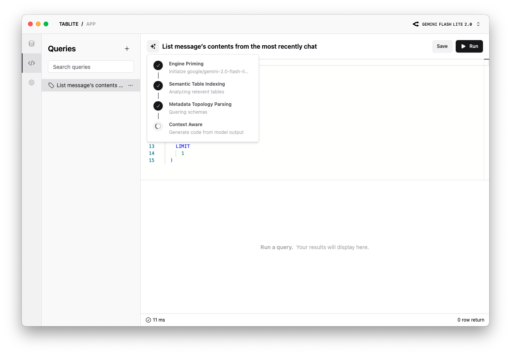

<h1 align="center">
  
  <div>Tablite</div>
</h1>

🪶 An ai driven lightweight database GUI for a better development experience built on `Tauri`.

## Features

- Lightweight and cross-platform build
- Natural language querying with multi-LLMs support
- Modern and easy-to-use interface
- Local data storage for secure (except for sending schema to your LLM provider)

Supported databases:

- SQLite
- MySQL

Supported LLMs:

- Gemini 2.0 Flash
- Gemini 1.5 Pro
- Gemini 1.5 Flash
- DeepSeek V3
- DeepSeek R1
- OpenRouter (Tools supported)



## Installation

You can download [Windows and Mac desktop app here](https://github.com/tmg0/tablite/releases)

For MacOS user with M1 or later, you need to execute the following command in terminal to allow the application downloaded form the internet:

```
sudo xattr -r -d com.apple.quarantine /Applications/Tablite.app
```

Or use the `x64` version in release page to bypass this issue.

## Usage

### Tables

- Fuzzy search for table names
- Dynamically filter tables with popover selectors
- Double-click a cell to enter edit mode
- Select rows for deletion
- Disvard changes or preview the actual SQL before saving
- Support re-editing SQL before saving

### Queries

- Fuzzy search for table names
- Automatically generate an SQL query from the title as a prompt
- `⌘` + `s` or click the `Save` button for saving
- Run the query and display the time costs

### Settings

- Select ai assistant based model
- Enter api keys for different providers

## Developing

```
pnpm install && pnpm tauri dev
```

## Roadmap

Ranking here very subjective and based on personal pain points.

### Milestone 1 - `table structure` && `connection management`

- View or edit columns and table index
- Create or delete table
- Connection settings page

### Milestone 2 - `form create connection`

Support create connection by a form instead of a connection string

- MySQL
- SQLite
- Postgres

### Milestone 3 - `chat with tables` & `export select results`

- Ai assistant
- Export select results

## License

[MIT](./LICENSE) License © 2024-PRESENT [Tamago](https://github.com/tmg0)
