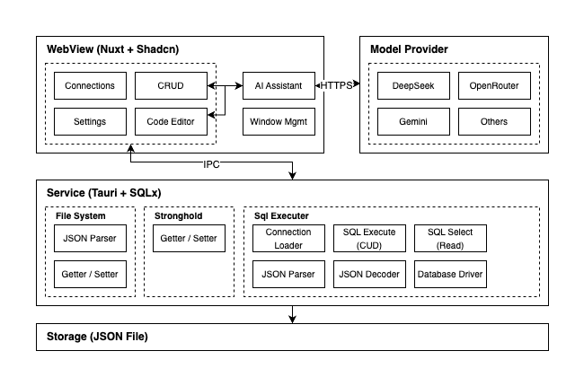

<h1 align="center">
  
  <div>Tablite</div>
</h1>

🪶 An ai driven lightweight database GUI built on `Tauri`.

## Features

- Lightweight and cross-platform build
- Natural language querying with multi-LLMs support
- Modern and easy-to-use interface
- Local data storage for secure (except for sending schema to your LLM provider)

Supported databases:

- SQLite
- MySQL

Supported LLMs:

- Gemini 2.0 Flash
- Gemini 1.5 Pro
- Gemini 1.5 Flash
- DeepSeek V3
- DeepSeek R1
- OpenRouter (Tools supported)


## Installation

You can download [Windows and Mac desktop app here](https://github.com/tmg0/tablite/releases)

For MacOS user with M1 or later, you need to execute the following command in terminal to allow the application downloaded form the internet:

```
sudo xattr -r -d com.apple.quarantine /Applications/Tablite.app
```

Or use the `x64` version in release page to bypass this issue.

## Usage

### Tables

- Fuzzy search for table names
- Dynamically filter tables with popover selectors
- Double-click a cell to enter edit mode
- Select rows for deletion
- Disvard changes or preview the actual SQL before saving
- Support re-editing SQL before saving

### Queries

- Fuzzy search for table names
- Automatically generate an SQL query from the title as a prompt
- `⌘` + `s` or click the `Save` button for saving
- Run the query and display the time costs

### Settings

- Select ai assistant based model
- Enter api keys for different providers

## Developing

```
pnpm install && pnpm tauri dev
```

### Comparisons

- Tauri: Small bundle size and low memory usage, dependence by user os, may have rendering differences across different systems/platforms due to WebKit version.

- Electron: Large bundle size and large mem usage, has high consistency in cross-platform application rendering.

|  | **Tauri** | **Electron** | **Gpui** | **Swift** |
|--|--|--|--|--|
| **Performance** | mid | low | high | high |
| **Cross Platform** | yes | yes | yes | no |
| **Community** | high | high | low | mid |
| **Size** | small | large | mid | mid |
| **Development** | mid | low | high | mid |
| **App** | ChatWise | DingTalk | Zed | Pages |

### Code Design



#### [`app`](./app)

WebView client application with official nuxt design (future.compatibilityVersion: 4), read [Directory Structure](https://nuxt.com/docs/guide/directory-structure/app).

#### [`app.composables`](./app/composables)

Reacitve vue hooks

#### [`src-tauri`](./src-tauri)

Tauri service root directory

#### [`src-tauri/src/lib.rs`](./src-tauri/src/lib.rs)

App instance entry, plugin register center (includes: sql-extra / log / store)

#### [`src-tauri/crates/tauri-plugin-sql-extra`](./src-tauri/crates/tauri-plugin-sql-extra)

Custom tauri plugin sql implement.

Heavily inspired by [tauri-plugin-sql](https://github.com/tauri-apps/tauri-plugin-sql) and extends its capabilities by adding support for multiple database types.

### Agents

#### [`Text to SQL`](./app/composables/useText2Sql.ts)

Generate executable sql query with natural language.

- Analysis relevant table names by model function calling
- Provide table schema with row index
- Generate prompt by preset templates
- Generate SQL query
- Format results and response with sse

## Roadmap

Ranking here very subjective and based on personal pain points.

### SQL Client

- Support create table by GUI
- Support create connection by a form instead of a connection string
- Support edit or create columns / index by GUI
- Support export table filter results to csv
- Collect SQL execute histories
- Better code auto completion

### AI Assistant

- Support table visualization dashboard generation
- Support custom table context
- Support inline assistant in code editor
- Support MCP service

## License

[MIT](./LICENSE) License © 2024-PRESENT [Tamago](https://github.com/tmg0)
